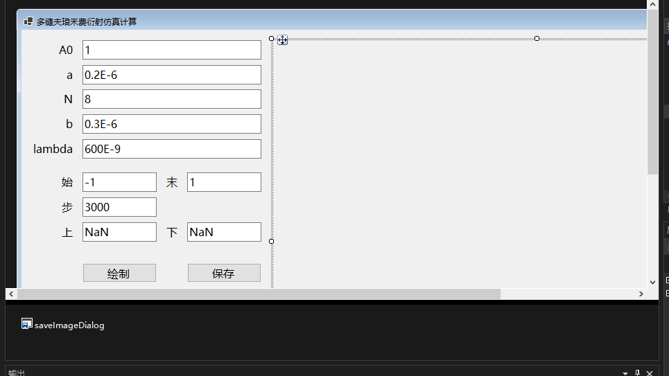

---
html:
    toc: true
    embed_local_images: true
    embed_svg: true
print_background: true
---


# 杨氏双缝干涉和多缝夫琅禾费衍射仿真计算（C#）


## 杨氏双缝干涉

> 题目：在一个杨氏双缝干涉装置中，双缝间距为 $4.0\mathrm{mm}$ ，缝与接受屏相距 $2.0\mathrm{m}$ ，接受屏倾斜 $30\degree$ ，入射光的波长为 $550.0\mathrm{nm}$ 。完成接受屏上的光强分布的仿真计算。

对于此题，我没有直接采用现有的直接关于杨氏双缝干涉的公式，而是从光的合成出发进行计算。

### 主要原理

先把双缝等效为自由空间中的两个无限长的线形光源，再等效为不实际存在的“二维”点光源，其发出“二维的”相干光。随后直接计算光屏上各点空间位置处的光照强度，就可以得到光屏上所成的像。

### 具体实现

仓库中的类库项目 `PointLighting` 和控制台应用项目 `YoungsDoubleSlitInterference` 是与此题相关的。

#### PointLighting 项目

其中，在 `PointLighting` 中设计了 `IdealPointLight2D` 类型以表示一个理想的“二维”点光源：

```csharp
namespace PointLighting.TwoDimension
{
    public sealed class IdealPointLight2D
    {
        public required Vector2D Position { get; init; }
        public required double Wavelength { get; init; }
        public required Vector2D PolarizationDirection { get; init; }

        /// <summary>
        /// 在零时刻时零距离处的相位。
        /// </summary>
        public required double Phase { get; init; }

        /// <summary>
        /// 与光源相距一个单位处的光照强度。
        /// </summary>
        public required double Intensity { get; init; }

        public double GetPhaseAt(
            Vector2D position, double time = 0, double refractivity = 1,
            PointLightingConsts? consts = null)
        {
            consts = consts ?? PointLightingConsts.Default;

            var distance = this.Position.GetDistanceBetween(position);
            var d1 = 2 * consts.Pi * refractivity * distance / Wavelength;
            var d2 = 2 * consts.Pi * consts.LightSpeed * time / Wavelength;
            return Phase + d1 + d2;
        }

        public double GetIntensityAt(Vector2D position)
        {
            var distanceSquare = this.Position.GetDistanceSquareBetween(position);
            return this.Intensity / distanceSquare;
        }
    }
}
```

此类型可以单独使用以计算相位和强度。所谓的二维，指的就是此处的计算是二维的形式，比如 `GetIntensityAt(Vector2D)` 方法直接使用 `this.Intensity / distanceSquare` 作为结果。而在三维情形中，应该使用距离的立方而不是平方。

但这并不是说真的有二维光或二维光源存在。只是因为后续在模拟杨氏双缝干涉时，我们不会希望放置一系列密集的点光源来进行模拟，因为这可能导致严重的性能问题。而无限长度的光源，和所谓“二维”点光源的表现却是一致的。

并且， `IdealPointLight2D` 可以被放置在一个有光照的空间 `LightedSpace2D` 中：

```csharp
using System.Collections.Immutable;

namespace PointLighting.TwoDimension
{
    public sealed class LightedSpace2D
    {
        public double Refractivity { get; }
        public ImmutableArray<IdealPointLight2D> Lights { get; }

        public LightedSpace2D(params IdealPointLight2D[] lights) : this(1, lights)
        { }

        public LightedSpace2D(double refractivity, IEnumerable<IdealPointLight2D> lights)
        {
            this.Refractivity = refractivity;
            this.Lights = lights.ToImmutableArray();
        }

        public double GetIntensityAt(Vector2D position, double wavelength, double delta = 1E-6)
        {
            delta = Math.Abs(delta);
            var lower = wavelength - delta;
            var upper = wavelength + delta;

            var lightVectors =
                from light in Lights
                where lower < light.Wavelength && light.Wavelength < upper
                let r = Math.Sqrt(light.GetIntensityAt(position))
                let theta = light.GetPhaseAt(position, time: 0, this.Refractivity)
                select new {
                    Vector = new Vector2D(r * Math.Cos(theta), r * Math.Sin(theta)),
                    Polarization = light.PolarizationDirection
                };

            var first = lightVectors.FirstOrDefault();
            if(first is null)
                return 0;
            Vector2D polarization = first.Polarization;
            Vector2D sum = first.Vector;
            foreach (var light in lightVectors.Skip(1))
            {
                if (polarization != light.Polarization)
                    throw new NotSupportedException("暂不支持振动方向不平行的情况");
                sum += light.Vector;
            }
            return sum.GetDistanceSquareBetween(new Vector2D(0, 0));
        }
    }
}
```

其 `GetIntensityAt(Vector2D, double, double)` 方法，就是通过矢量法将光进行合成，从而计算所有光源发出的某个波长的光在某点的和强度。

至此，我们只需要创建出所需的相干光源 `IdealPointLight2D` ，放置在 `LightedSpace2D` 中，就可以获取到空间中任意一点的光照强度了。

考虑到其通用性，我把以上内容专门放置到了类库项目 `PointLighting` 中。希望可以后续再加入更多相关的内容，让它正式成为单独的可用的包。同时包括在其中的还有工具类型 `Vector2D` 和 `PointLightingConsts` 。

#### YoungsDoubleSlitInterference 项目

而项目 `YoungsDoubleSlitInterference` 则是具体运行的模拟程序，它使用上述类库绘制了题目中所要求的图像。

首先，直接以题目中给出的参数创建 `IdealPointLight2D` 和 `LightedSpace2D` ：

```csharp
// 1. 创建 LightedSpace2D 空间
var light1 = new IdealPointLight2D() {
    Phase = 0,
    Intensity = 1,
    PolarizationDirection = new Vector2D(0, 0),
    Position = new Vector2D(0, 2E-3),
    Wavelength = 550E-9,
};

var light2 = new IdealPointLight2D() {
    Phase = 0,
    Intensity = 1,
    PolarizationDirection = new Vector2D(0, 0),
    Position = new Vector2D(0, -2E-3),
    Wavelength = 550E-9,
};

var space = new LightedSpace2D(light1, light2);
```

其中，我对题目的理解是光在通过双缝时是等相位的，由于相位具体是多少不会导致区别，因此都取了 $0$ 。同时，单位距离处的强度都取了 $1$ ，偏振方向不会参与计算，就取了 $(0, 0)$ 。


随后，创建两个光屏，其中 `screen1` 是题目要求的光屏（题目中接受屏和缝的距离，理解为两者中心的距离）， `screen2` 是一个没有倾斜过的光屏：

```csharp
// 2. 创建两个 Screen 光屏
const int size = 5000;

var screen1 = new Screen<int>((t) => {
    double length = (t - size / 2) * 0.000001;
    return new Vector2D(2 + length / 2, length * Math.Sqrt(3) / 2);
}, Enumerable.Range(0, size));

var screen2 = new Screen<int>((t) => {
    double length = (t - size / 2) * 0.000001;
    return new Vector2D(2, length);
}, Enumerable.Range(0, size));
```

其中 `Screen` 类型的实现如下：

```csharp
using PointLighting.TwoDimension;

namespace YoungsDoubleSlitInterference
{
    public sealed class Screen<T>
    {
        public delegate Vector2D FunctionOfScreen(T parameter);

        private readonly FunctionOfScreen function;
        private readonly T[] parameters;

        public Screen(FunctionOfScreen screen, IEnumerable<T> parameters)
        {
            this.function = screen;
            this.parameters = parameters.ToArray();
        }

        public IEnumerable<(T Parameter, Vector2D Position, double Intensity)> Image(
            LightedSpace2D space, double wavelength)
        {
            foreach (var parameter in this.parameters)
            {
                var position = function(parameter);
                var intensity = space.GetIntensityAt(position, wavelength);
                yield return (parameter, position, intensity);
            }
        }
    }
}
```

它的 `Image(LightedSpace2D, double)` 方法通过调用给定的函数 `function` （ `screen` ） 和参数序列 `parameters` 来确定光屏所在的位置，然后使用 `LightedSpace2D.GetIntensityAt()` 方法，获取对应位置的光照强度。这样就可以把参数、位置和光照强度三者对应地返回出来，让后续作图更加方便。

随后，我使用了 `SixLabors.ImageSharp.Drawing` ，从而可以绘制实际观察时所看到的图样（而没有使用直接数据可视化相关的包），并兼容更多操作系统（而没有选择 `System.Drawing.Common` ）：

```csharp
// 3. 绘制用眼观察 screen1 时大致所能看到的图样
using (Image<Rgba32> output = new(size, 1000))
{
    output.Mutate(p => {
        _ = p.BackgroundColor(Color.Black);
    });

    var color = Color.Green;
    foreach (var current in screen1.Image(space, 550E-9))
    {
        output.Mutate((p) => {
            _ = p.DrawLines(
                color.WithAlpha((float)current.Intensity),
                thickness: 1,
                new Point(current.Parameter, 0),
                new Point(current.Parameter, 1000));
        });
    }
    output.SaveAsPng("out1.png");
}
```

其中需要把光波长和光照强度对应到计算机中所用的颜色表示。我所用的取法是 $550\mathrm{nm}$ 属于绿色光，因此直接选用了 `Color.Green` ；而光照强度则线性地转换为透明度，加以黑色的背景。就大致的效果来看，基本上是符合实际的：


最后还绘制了光照强度的曲线（这里仍使用了 `SixLabors.ImageSharp.Drawing` ，而在下文的“复用方式”部分，包含了使用 `OxyPlot.Core` 以更方便地绘制图像的样例）：

```csharp
// 4. 绘制两种光屏上光照强度的图像
using (Image<Rgba32> output = new(size, 1000))
{
    {
        var image = screen2.Image(space, 550E-9)
            .Select(i => new PointF(i.Parameter, (float)(i.Intensity * 800 + 100)));
        var last = image.First();
        foreach (var current in image.Skip(1))
        {
            output.Mutate((p) => {
                _ = p.DrawLines(Color.Blue, 5, last, current);
            });
            last = current;
        }
    }

    {
        var image = screen1.Image(space, 550E-9)
            .Select(i => new PointF(i.Parameter, (float)(i.Intensity * 800 + 100)));
        var last = image.First();
        foreach (var current in image.Skip(1))
        {
            output.Mutate((p) => {
                _ = p.DrawLines(Color.Black, 5, last, current);
            });
            last = current;
        }
    }

    output.Mutate(c => {
        _ = c.Rotate(RotateMode.Rotate180);
    });
    output.SaveAsPng("out2.png");
}
```


其中题目要求的 `screen1` 使用的是黑色的线条，而没有倾斜的 `screen2` 是蓝色的。

### 仿真结果

最终得到的结果已经在上述过程中出现：


可以看出倾斜后仍会呈现明暗相间的干涉条纹。

而把倾斜前后的光照强度进行比较：


可以发现，在倾斜 $30\degree$ 后，条纹间距变宽了。

### 复用方式

#### 复用 YoungsDoubleSlitInterference

1. 运行 `YoungsDoubleSlitInterference` ：
    - Windows 系统：在仓库[发行版](https://gitee.com/yueyinqiu5990/tj12401101/releases)下载 `YoungsDoubleSlitInterference-win-x86.exe` ，双击即可运行。
    - 任何系统（框架依赖）：在仓库[发行版](https://gitee.com/yueyinqiu5990/tj12401101/releases)下载 `YoungsDoubleSlitInterference.zip` 并解压。确认已经安装 [dotnet 7](https://dotnet.microsoft.com/zh-cn/download/dotnet/7.0) 或更高版本的运行时，使用 `dotnet YoungsDoubleSlitInterference.dll` 命令即可运行程序。
2. 运行完毕后，可直接在同目录下找到生成的 `out1.png` 和 `out2.png` 。

#### 复用 PointLighting

由于 `YoungsDoubleSlitInterference` 是固定的程序，只能绘制出先前的两幅图像，因此一般不会再复用它，而是借助 `PointLighting` 来创建自己的模拟。

1. 在仓库[发行版](https://gitee.com/yueyinqiu5990/tj12401101/releases)下载 `PointLighting.x.x.x.nupkg` ，放置在本地的 nuget 包源中；
2. 创建模拟项目，并安装此包，即可使用此包的功能。

##### 样例：观察较远处的干涉

样例的代码包含在 `PointLightingSample1` 中。

其引用了 `PointLighting` 和 `OxyPlot.Core` 两个包，后者用以直接绘制可视化图像，因此代码比较简单：

```csharp
using PointLighting.TwoDimension;
using OxyPlot;
using OxyPlot.Series;

Console.WriteLine("运行中……");

var light1 = new IdealPointLight2D() {
    Phase = 0,
    Intensity = 1,
    PolarizationDirection = new Vector2D(0, 0),
    Position = new Vector2D(0, 2E-3),
    Wavelength = 550E-9,
};

var light2 = new IdealPointLight2D() {
    Phase = 0,
    Intensity = 1,
    PolarizationDirection = new Vector2D(0, 0),
    Position = new Vector2D(0, -2E-3),
    Wavelength = 550E-9,
};

var space = new LightedSpace2D(light1, light2);

var plot = new PlotModel();
plot.Series.Add(new FunctionSeries(
    length => space.GetIntensityAt(new Vector2D(2, length), 550E-9),
    0, 0.001, 0.0000001));

plot.Series.Add(new FunctionSeries(
    length => space.GetIntensityAt(new Vector2D(2, length + 1.0002), 550E-9),
    0, 0.001, 0.0000001));

var svgExporter = new SvgExporter { Width = 1000, Height = 1000 };
using (var file = File.Create("out.svg"))
    svgExporter.Export(plot, file);

Console.WriteLine("文件已生成。可以按回车键退出。");
Console.ReadKey();
```

也就是，先创建出 `LightedSpace2D` ，然后选取 $(2,0)$ 到 $(2,0.001)$ 和 $(2,1.0002)$ 到 $(2,1.0012)$ 两个范围进行作图即可。为了绘制在一张图中，后者向左平移了 $1.0002$ 个单位，最终得到这样的图像：


可以看出，在较远处，亮度会有所减小，并且条纹间距也并非不变的，等间距只是旁轴近似下的结论。

此样例项目的生成结果也提供在了在仓库[发行版](https://gitee.com/yueyinqiu5990/tj12401101/releases)中，名为 `PointLightingSample1.exe` ，与 `YoungsDoubleSlitInterference-win-x86.exe` 的使用方法类似。

## 多缝夫琅禾费衍射

> 题目：在多缝夫琅禾费衍射中，缝数 $N=8$ ，缝宽为 $0.2 \mathrm{\mu m}$ ，缝距为 $0.3\mathrm{\mu m}$ ，入射光波长为 $600\mathrm{nm}$ ，透镜L2的焦距为 $10.0\mathrm{mm}$ 。完成接受屏上的光强分布的仿真实验。

在本题中我打算直接使用相关的公式，但是制作一个更方便在 Windows 系统上使用的仿真程序。

### 主要原理

直接利用下述公式作图：

$$
I_\theta=A_0^2\left(\frac{\sin\alpha}{\alpha}\right)^2\left(\frac{\sin{\frac{N\delta}{2}}}{\frac{\delta}{2}}\right)^2
$$

其中

$$
\left\{
    \begin{array}{ll}
        d=a+b
        \\
        \delta=\frac{2\pi d}{\lambda}\sin\theta
        \\
        \alpha=\frac{\pi a}{\lambda}\sin\theta
    \end{array}
\right.
$$

### 具体实现
根据公式，可以写出如下的 `Calculator` ：

```csharp
using System;
using System.Collections.Generic;
using System.Linq;
using System.Text;
using System.Threading.Tasks;

namespace FraunhoferDiffractionThroughMultipleSlits
{
#pragma warning disable IDE1006
    public sealed record Calculator(double A0, double a, int N, double b, double Lambda)
#pragma warning restore IDE1006
    {
        private static double Square(double value) => value * value;

        public double ITheta(double sinTheta)
        {
            var d = a + b;
            var delta = 2 * Math.PI * d * sinTheta / Lambda;
            var alpha = Math.PI * a * sinTheta / Lambda;
            return Square(A0 *
                (Math.Sin(alpha) / alpha) *
                (Math.Sin(N * delta / 2) / Math.Sin(delta / 2)));
        }
    }
}
```

随后，使用 WinForm 框架，设计出以下界面，其中默认填入的参数就是题目中所给的参数：



现在只需读出界面上填入的值，通过 `Calculator` 进行计算，然后再借助 `System.Windows.Forms.DataVisualization` 绘制曲线：

```csharp
using System.Windows.Forms.DataVisualization.Charting;

namespace FraunhoferDiffractionThroughMultipleSlits
{
    public partial class MainForm : Form
    {
        private readonly Chart chart;
        public MainForm()
        {
            InitializeComponent();

            this.chart = new Chart() {
                Dock = DockStyle.Fill,
                BackColor = Color.White
            };
            chart.ChartAreas.Add(new ChartArea());
            chart.Series.Add(new Series());
            chart.Series[0].ChartType = SeriesChartType.Line;
            this.panelOfChart.Controls.Add(chart);

            this.Load += (_, _) => this.buttonStartDrawing.PerformClick();
        }

        private void ButtonStartDrawingClick(object sender, EventArgs e)
        {
            this.labelForPrompt.Text = "";

            if (!double.TryParse(this.textBoxOfA0.Text, out double A0) ||
                !double.TryParse(this.textBoxOfa.Text, out double a) ||
                !double.TryParse(this.textBoxOfb.Text, out double b) ||
                !double.TryParse(this.textBoxOfLambda.Text, out double lambda) ||
                !int.TryParse(this.textBoxOfN.Text, out int N) ||
                !double.TryParse(this.textBoxOfStart.Text, out double start) ||
                !double.TryParse(this.textBoxOfEnd.Text, out double end) ||
                !int.TryParse(this.textBoxOfStepCount.Text, out int stepCount) ||
                !double.TryParse(this.textBoxOfUpper.Text, out double upper) ||
                !double.TryParse(this.textBoxOfLower.Text, out double lower))
            {
                this.labelForPrompt.Text = "无法解析输入的内容";
                return;
            }

            var calculator = new Calculator(A0, a, N, b, lambda);
            Draw(calculator, start, end, stepCount, upper, lower);
        }

        private void Draw(
            Calculator calculator, 
            double start, double end, int stepCount,
            double upper, double lower)
        {
            var chartPoints = chart.Series[0].Points;
            chartPoints.Clear();

            chart.ChartAreas[0].AxisY.Maximum = upper;
            chart.ChartAreas[0].AxisY.Minimum = lower;

            var step = (end - start) / stepCount;
            for (int i = 0; i < stepCount; i++)
            {
                var x = start + i * step;
                _ = chartPoints.AddXY(x, calculator.ITheta(x));
            }
        }

        private void ButtonSaveImageClick(object sender, EventArgs e)
        {
            if (this.saveImageDialog.ShowDialog() is DialogResult.OK)
                this.chart.SaveImage(this.saveImageDialog.FileName, ChartImageFormat.Png);
        }
    }
}
```

### 仿真结果

最终的运行效果如图所示，绘制的是 $I_\theta - \sin\theta$ 曲线：


它不能观察到多个主极大，这是因为所给的 $\frac{\lambda}{d}>1$ 。若要观察相关的现象，可以考虑修改所给的参数。

比如，将 $a$ 和 $b$ 放大十倍，可以观察到一系列的主极大、次极大和零点，并且能在 $\sin\theta = 0.6$ 附近观察到缺级现象：


局部放大后也可以更容易地观察次极大的个数和零点的个数：


### 复用方式

在仓库[发行版](https://gitee.com/yueyinqiu5990/tj12401101/releases)下载 `FraunhoferDiffractionThroughMultipleSlits.exe` ，双击运行即可。